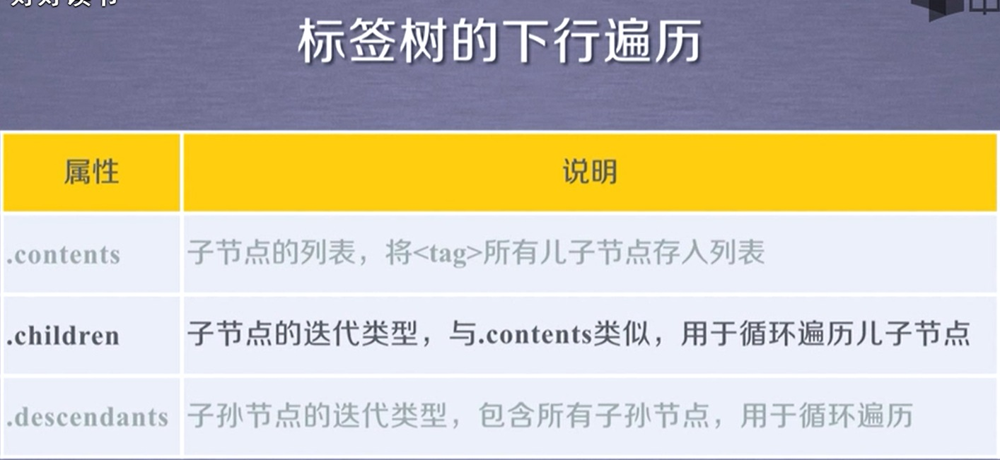

requests

get、head、post、put、patch、delete等都是调用的requests接口

```python
requests.request()	#构造一个方法，下面个方法的基础
requests.get()	#发送GET请求
requests.head()	#发送HEAD请求，获取HTML网页头的主要方法
requests.post()	#提交POST请求
requests.put()	#提交PUT请求
requests.patch()	#提交PATCH请求，HTML网页局部修改请求
requests.delete()	#提交DELETE请求
```

requests库异常

```python
requests.ConnectionError	#网络连接错误，如DNS查询失败，拒绝连接等
requests.HTTPError	#HTTP错误
requests.URLRequired	#URL缺失
requests.TooManyRedirects	#超过最大重定向次数
requests.ConnectTimeout	#连接远程服务器超时
requests.Timeout	#请求URL超时	
```

```python
status_code	#网站返回的状态码
encoding	#根据HTTP header猜测的编码格式，若无HTTP header，则默认为ISO-8859-1
qpparent_encoding 	#根据内容分析出的编码格式（备用编码方式）
text	#HTTP相应内容的字符串形式
content	#HTTP相应内容的二进制形式
```

##### 搜索引擎关键字提交接口

```
百度	http://www.baidu.com/s?wd=[keyword]
360	http://www.so.com/s?q=[keyword]
必应	https://cn.bing.com/search?q=[keyword]
谷歌	http://www.google.com/search?q=[keyword]
```

##### 查IP地址的归属地网站

```
http://m.ip138.com
```

##### BeautifulSoup库





```
<>.find_all(name,attrs,recursive,string,**kwargs)	查找标签，返回一个列表类型，储存查找的结果(简写<>()，即可以省略'.find_all')
name:对标签名称的检索字符串
attrs:对标签属性值的检索字符转，可标记属性检索
recursive:是否对子孙全部检索，默认True
string:<>...</>中字符串区域的检索字符串
```


##### format格式化输出

```python
print("{:.2f}".format(3.1415926))	#保留小数点后两位
print("{:+.2f}".format(3.1415926))	#带符号保留小数点后两位
#^、<、> 分别为居中、左对齐、右对齐，后面带宽度
#:后带要填充的字符，只能为一个字符，默认空格
```


python正则表达式库	re

正则表达式：用一个字符串表示一组有规律得到字符串（表示字符串的规律）


re库默认采用贪婪匹配的方式，即输出匹配最长的部分。


#### Scrapy框架

##### Scrapy爬虫框架结构

"5+2"结构	5个模块+两个中间件

过程:

请求->调度->获取源码->解析->完成


###### Spider

- 解析Downloader返回的响应(Response)
- 爬取项(scraped item)
- 产生额外的爬取请求(Request)

###### Item Pipelines

- 以流水线的方式处理spider产生的爬取项
- 由一组操作顺序组成，类似流水线，每一个操作是一个Item Pipelines类型
- 可能操作包括：清理、检验和查重爬取项中的HTML数据、将数据存到数据库

###### Download Middleware

- 目的：实施Engine、Scheduler和Downloader之间进行用户可配置的控制
- 功能：修改、丢弃、新增请求或相应

###### Spider Middleware

- 目的：对请求和爬取项的再处理
- 功能：修改、丢弃、新增请求或爬取项


运行scrapy命令需要再前面加上 python -m	（-m参数为将后面的python模块作为脚本运行）

###### python关键字yield

​	yield	<—>	生成器

- 生成器是一个不断产生值的函数
- 包涵yield语句的函数时一个生成器
- 生成器每次产生一个值（yield语句），函数被冻结，被唤醒后再产生一个值